<p align="center">
  
</p>

<h1 align="center">native-api-bindgen</h1>

<p align="center">
  <strong>Use native APIs directly. Generate the binding, not the boilerplate.</strong>
</p>

<p align="center">
  <a href="https://lkrjangid1.github.io/native-api-bindgen-docs/">Website</a> ·
  <a href="https://lkrjangid1.github.io/native-api-bindgen-docs/docs/getting-started/index.html">Get started</a> ·
  <a href="CONTRIBUTING.md">Contribute</a> ·
  <a href="SECURITY.md">Security</a> ·
  <a href="LICENSE">Apache-2.0 licence</a>
</p>

<!-- IMAGE: docs/images/hero-banner.png — see docs/images/README.md for the prompt -->
<p align="center">
  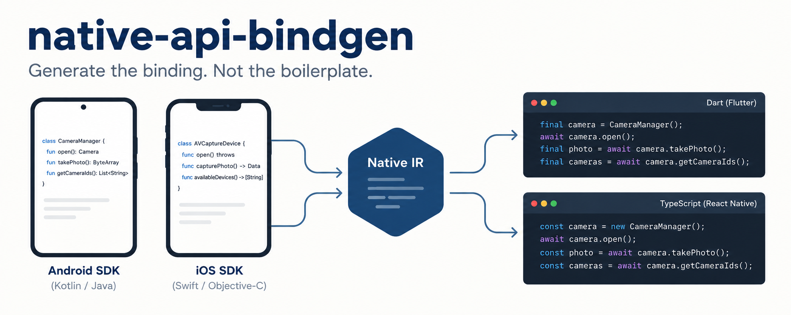
</p>

`native-api-bindgen` reads the Android and iOS SDKs that are already installed on your machine and generates **typed bindings** for them:

- **Flutter / Dart:** over [`package:jni`](https://pub.dev/packages/jni) (Android) and [`package:objective_c`](https://pub.dev/packages/objective_c) (iOS).
- **React Native / TypeScript:** New Architecture, over JSI + C++ with JNI (Android) or Objective-C++ (iOS).

No MethodChannel, no hand-written plugin per API, no copied SDK files.

> **Status: beta (`0.1.0-beta.1` on pub.dev).**
> - All four combinations work end to end: Flutter and React Native, each on Android and iOS.
> - They are tested on an Android emulator and an iOS simulator, **not yet on physical devices**.
> - Generated APIs, configuration and output may still change.
> - Nothing is advertised as supported until a test proves it.

---

## Contents

- [Why it exists](#why-it-exists)
- [How it works](#how-it-works)
- [What you get per platform](#what-you-get-per-platform)
- [Quick start](#quick-start)
- [The developer flow](#the-developer-flow)
- [Examples](#examples)
- [Runtime flows (what happens on a call)](#runtime-flows-what-happens-on-a-call)
- [Measured results](#measured-results)
- [Keeping up with new SDK versions](#keeping-up-with-new-sdk-versions)
- [What it does not do](#what-it-does-not-do)
- [Repository layout](#repository-layout)
- [Documentation](#documentation)
- [Legal / source policy](#legal--source-policy)
- [License](#license)

---

## Why it exists

Calling one platform API that your framework does not expose usually means writing and maintaining:

- a MethodChannel handler (Kotlin/Swift) plus its Dart counterpart, or a TurboModule spec plus a native implementation;
- JNI boilerplate or Objective-C wrappers;
- thread hopping between the UI thread and the framework thread;
- updates every time Android or iOS ships a new SDK.

`native-api-bindgen` generates that layer from **first-party SDK metadata**:

- every generated symbol is traceable to the native symbol it came from (`why-generated`);
- for everything it could not generate, it tells you exactly why, with a stable reason code (`why-skipped`).

<!-- IMAGE: docs/images/before-after.png — see docs/images/README.md for the prompt -->
<p align="center">
  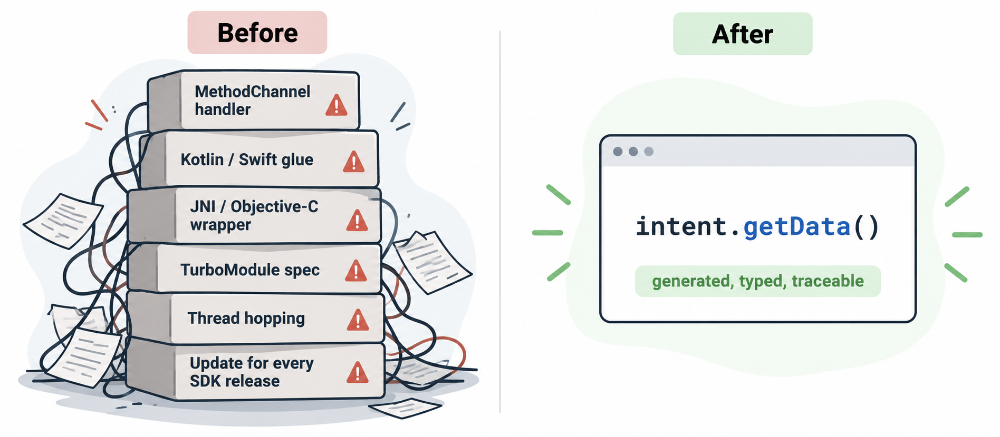
</p>

---

## How it works

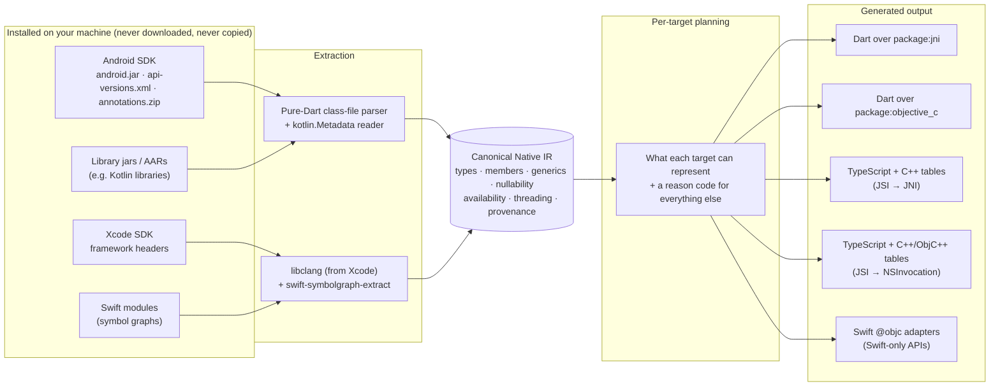

Key ideas:

1. **One canonical model (IR)** for both platforms. It is deterministic (the same SDK gives byte-identical output) and serializable to JSON for diagnostics.
2. **Planning is explicit.** Each target decides what it can represent. Skipped symbols carry a reason code such as `E004 UNSUPPORTED_CALLBACK`, and `coverage` reports them.
3. **No registry, no startup work.**
   - Dart bindings are zero-cost extension types, and unused ones are removed by tree shaking.
   - React Native bindings are data tables that a small runtime reads lazily.
4. **Thin runtimes:**
   - `runtimes/dart/native_api_runtime`: availability guards, error model, Kotlin coroutines, byte helpers.
   - `runtimes/jsi`: the C++ / Objective-C++ / TypeScript runtime for React Native.
   - `runtimes/jni`: Java helpers.

<!-- IMAGE: docs/images/architecture-diagram.png — see docs/images/README.md for the prompt -->
<p align="center">
  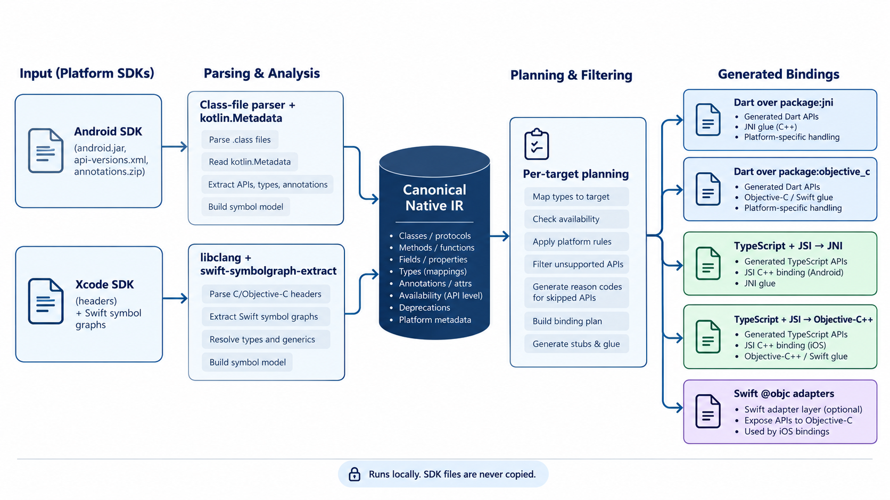
</p>

---

## What you get per platform

| Capability | Flutter · Android | Flutter · iOS | React Native · Android | React Native · iOS |
|---|:---:|:---:|:---:|:---:|
| Classes, methods, fields, constants, overloads | ✅ | ✅ | ✅ | ✅ |
| Nullability, availability guards (`minApi` / `minVersion`) | ✅ | ✅ | ✅ | ✅ |
| Native exceptions / `NSError **` as typed errors | ✅ | ✅ | ✅ | ✅ |
| Generics | ✅ Dart type parameters | — | erased to bounds | — |
| Bean properties (`getX`/`setX` → `x`) | ✅ | ObjC properties | ✅ | ObjC properties |
| Typed `@IntDef` / `@StringDef` constants | ✅ | — | ✅ | — |
| Implement Java interfaces / ObjC protocols | ✅ interfaces | ⚠️ protocols: E004 | ✅ interfaces | ✅ protocols |
| Callbacks / blocks | ✅ | ✅ `NS_NOESCAPE` + escaping primitive blocks | ✅ | ✅ all convertible blocks |
| Kotlin `suspend` | ✅ `Future` | — | ✅ `Promise` | — |
| Kotlin `Flow` | ✅ `Stream` | — | opaque object | — |
| Swift-only APIs (generated `@objc` adapters) | — | ✅ incl. async, throws, enums, collections | — | via adapters |
| Main-thread rules | `@MainThread` docs | `NS_SWIFT_UI_ACTOR` debug check | `@MainThread` docs | dispatched to main |
| Byte buffers | `byte[]`, direct `ByteBuffer` | `NSData` zero-copy view | `Uint8Array` | `Uint8Array` ↔ `NSData` |
| Show native views | ✅ `NativeView.android` | ✅ `NativeView.ios` | ✅ `<NativeView>` | ✅ `<NativeView>` |

✅ tested on emulator/simulator · ⚠️ partial / with a reason code · — not applicable or not supported yet.
Details: [docs/android](docs/android/README.md), [docs/ios](docs/ios/README.md), [docs/react-native](docs/react-native/README.md), [docs/native-ui.md](docs/native-ui.md).

---

## Quick start

### Requirements

| You want | You need |
|---|---|
| Android bindings | Android SDK with a platform (e.g. `android-36`), a JDK |
| iOS bindings | macOS with Xcode (libclang and the iOS SDK come with it) |
| Flutter target | Flutter 3.32+ (tested with 3.41.9) |
| React Native target | React Native 0.76+ with the New Architecture (tested with 0.87.1) |

### Install the CLI

From [pub.dev](https://pub.dev/packages/native_api_bindgen) or Homebrew (macOS / Linux, prebuilt binary):

```bash
dart pub global activate native_api_bindgen
# or
brew install lkrjangid1/tap/native-api-bindgen
native-api-bindgen doctor        # shows the SDKs, JDK, Xcode and libclang it found
```

From a clone: `dart pub get && dart pub global activate --source path packages/native_api_cli`.

### Configure and generate

```bash
cd my_app
native-api-bindgen init          # writes native_api_bindgen.yaml
```

```yaml
# native_api_bindgen.yaml
platform:
  android:
    platform: "36"
    minApi: 24
    entries:                     # what you need; dependencies follow up to `depth`
      - android.content.Intent
      - android.net.Uri
    depth: 0
  ios:
    minVersion: "15.0"
    frameworks: [Foundation, UIKit]
    classes: [UIDevice, UIView]
    depth: 0

targets:
  flutter: true
  reactNative: false

output:
  dir: lib/src/generated
```

```bash
native-api-bindgen generate flutter        # Android → Dart
native-api-bindgen generate ios            # iOS → Dart
native-api-bindgen generate react-native   # Android + iOS → TypeScript (+ C++ / ObjC++)
```

Step-by-step guide: [docs/getting-started](docs/getting-started/README.md).

<!-- IMAGE: docs/images/cli-terminal.png — see docs/images/README.md for the prompt -->
<p align="center">
  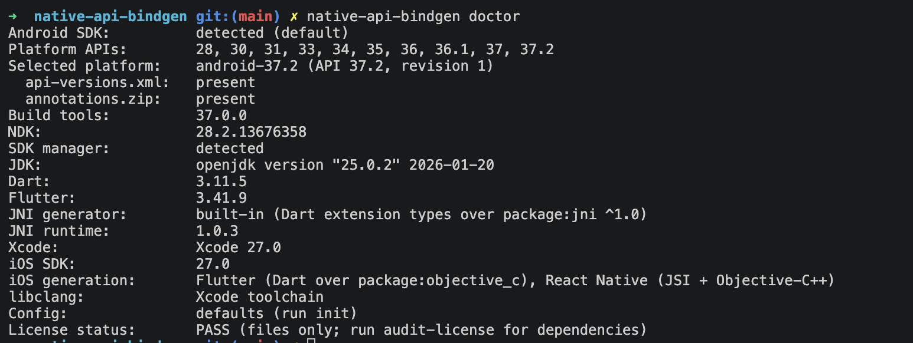
</p>

---

## The developer flow

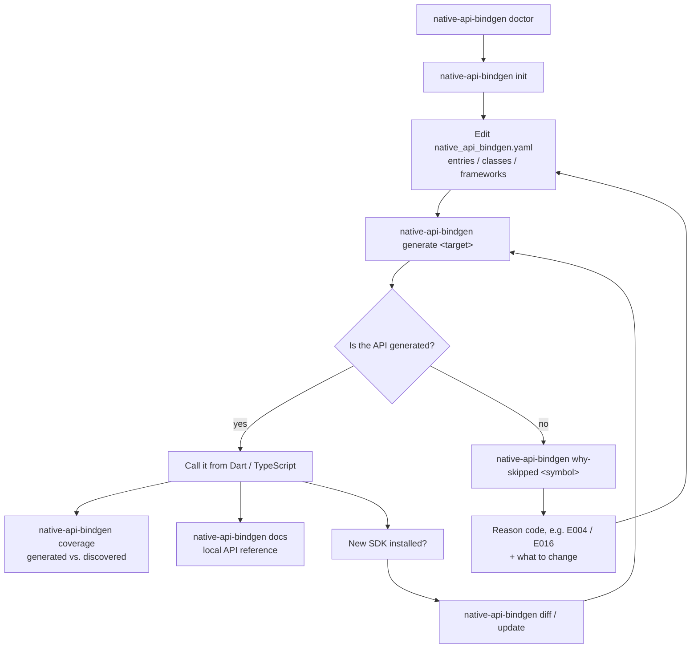

Useful commands:

```bash
native-api-bindgen coverage                                  # what was generated, and why not
native-api-bindgen why-skipped 'android.app.Activity#onCreate'
native-api-bindgen why-generated 'android.content.Intent#getData()'
native-api-bindgen explain 'UIDevice#systemName'
native-api-bindgen docs                                      # generated-docs/ (metadata + official links)
native-api-bindgen audit-license                             # nothing restricted gets committed
native-api-bindgen verify-reproducible                       # byte-identical regeneration
```

---

## Examples

### Flutter on Android

```dart
import 'package:jni/jni.dart';
import 'src/generated/bindings.dart';

final uri = Uri.parse('https://example.com/p?q=1'.toJString())!;
print(uri.scheme);                                   // bean property over Uri#getScheme()

final intent = Intent.new$String$Uri(Intent.ACTION_VIEW.toJString(), uri)
  ..setFlags(Intent$Flag.FLAG_ACTIVITY_NEW_TASK | Intent$Flag.FLAG_ACTIVITY_CLEAR_TOP);

// Implement a Java interface in Dart.
final handler = Handler.new$Looper(Looper.getMainLooper()!);
handler.post(Runnable.implement($Runnable(run: () => print('main looper'))));

// Kotlin library: suspend → Future, Flow → Stream.
final text = await greeter.greetLater(20);
await for (final i in greeter.countTo(3)) print(i);
```

### Flutter on iOS

```dart
import 'src/generated/apple.dart' as ios;

print(ios.UIDevice.currentDevice.systemName.toDartString());   // iOS

try {
  ios.NSFileManager.defaultManager.contentsOfDirectoryAtPath('/missing'.toNSString());
} on ios.NativeObjCError catch (e) {
  print(e.domain);                                              // NSCocoaErrorDomain
}

// A completion handler as a Future.
final finished = await ios.UIView.animateWithDuration$animations$completionAsync(
    0.2, animations: () {});
```

### React Native (TypeScript)

```ts
// Android
const intent = Intent.new$String$Uri(Intent.ACTION_VIEW, Uri.parse('https://example.com'));
const bytes = Arrays.copyOf(new Uint8Array([1, 2, 3]), 2);    // byte[] ↔ Uint8Array
const greeting = await greeter.greetLater(20n);               // Kotlin suspend → Promise

// iOS
const sorted = views.sortedArrayUsingComparator((a, b) =>
  a!.as(UIView).tag < b!.as(UIView).tag ? -1n : 1n);          // a block written in JS
fileManager.delegate = NSFileManagerDelegate.implement({      // a protocol written in JS
  fileManager$shouldRemoveItemAtPath: () => false,
});
```

### Show a native view

```dart
NativeView.android(view: TextView(context)..setText$CharSequence('Hi'.toJString()));
NativeView.ios(view: ios.UILabel.new$()..text = 'Hi'.toNSString());
```

```tsx
<NativeView view={label} style={{ width: 200, height: 48 }} />
```

Full apps with on-device test suites:

- [examples/flutter/android_slice](examples/flutter/android_slice)
- [examples/flutter/ios_slice](examples/flutter/ios_slice)
- [examples/react-native/slice](examples/react-native/slice)

<!-- IMAGE: docs/images/example-apps.png — see docs/images/README.md for the prompt -->
<p align="center">
  
</p>

---

## Runtime flows (what happens on a call)

### Flutter → Android

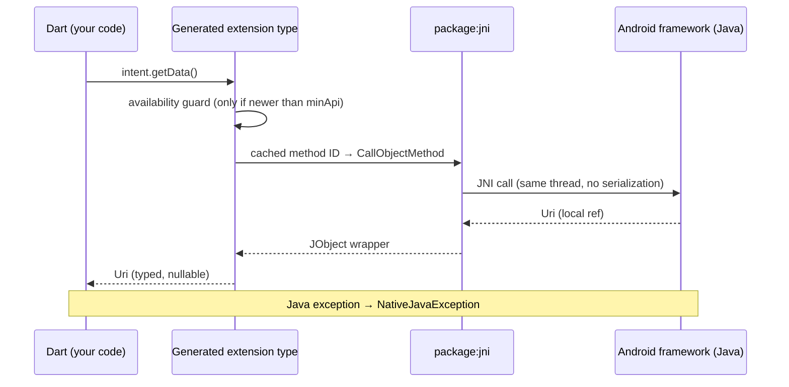

### React Native → iOS

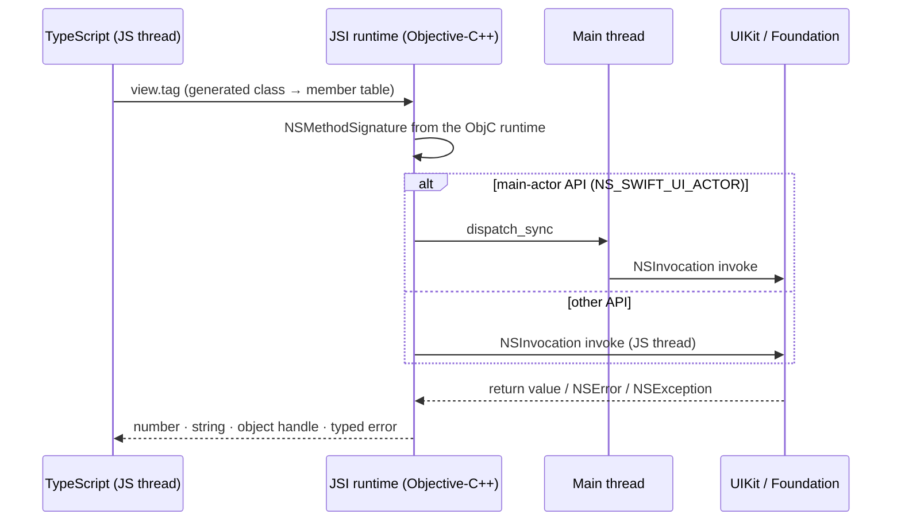

### Callbacks back into your code

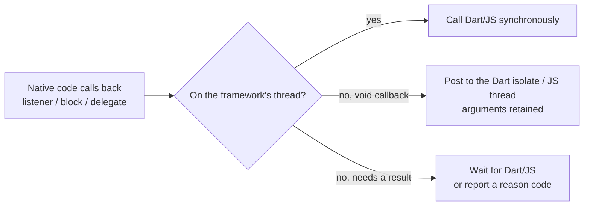

<!-- IMAGE: docs/images/runtime-flow.png — see docs/images/README.md for the prompt -->
<p align="center">
  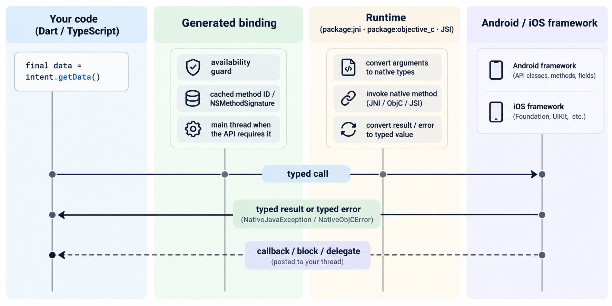
</p>

---

## Measured results

All numbers are measured on an emulator or simulator (2026-10-05, Apple-silicon Mac); physical devices have not been measured yet. Raw data and conditions are in [docs/benchmarks](docs/benchmarks).

| Measurement | Result |
|---|---|
| Coverage, entire `android.jar` (android-36), Flutter target | 51,429 of 52,938 methods generated (97.1%) |
| Coverage, Foundation + UIKit (iOS 27.0 SDK), Flutter target | 11,092 of 11,937 methods generated (92.9%) |
| Flutter Android release APK, one API used | identical size with bindings for 24 types or for **the whole SDK** (unused code is removed) |
| Flutter iOS release app, one API used | `App` binary identical with 6-class or full Foundation + UIKit bindings; +302,937 bytes vs. an app without bindings |
| Dart → Java call (profile, emulator) | ~1 µs vs. ~270 µs for an equivalent MethodChannel round trip |
| 1 MB bytes Dart → Java → Dart | 1.80 ms vs. 9.02 ms via MethodChannel |
| React Native: 1 MB `Uint8Array` → `byte[]` → back | 1.61 ms (vs. 99.6 ms as `number[]`) |

React Native does **not** tree-shake. Generate only what you use (`entries` + `depth`); see [docs/benchmarks/size.md](docs/benchmarks/size.md).

<!-- IMAGE: docs/images/benchmark-chart.png — see docs/images/README.md for the prompt -->
<p align="center">
  
</p>

---

## Keeping up with new SDK versions

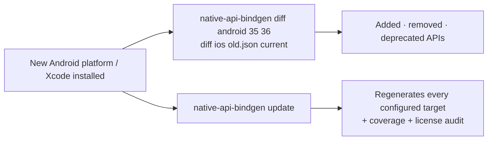

New APIs get availability guards automatically: calling an API that is newer than the device throws `NativeApiUnavailableException` / `NativeApiUnavailableError` instead of crashing. See [docs/versioning.md](docs/versioning.md).

---

## What it does not do

- **No private or hidden APIs.** Non-SDK Android APIs and private Objective-C selectors are never generated.
- **No SDK redistribution.** Generation runs against SDKs installed locally; generated bindings stay in your project (`generatedArtifacts: local-only`).
- **No copied documentation prose.** Generated docs contain metadata and links to the official references.
- **No claim of complete coverage.** `coverage` and `why-skipped` show what was not generated and why.

Known limitations (each with a reason code):

- Flutter iOS cannot implement protocols, and cannot pass escaping blocks that take objects; both need generated native trampolines (`E004`).
- Kotlin `Flow` on React Native is an opaque object.
- Kotlin default arguments are not applied through JNI.

Full list: [docs/roadmap.md](docs/roadmap.md) and [docs/compatibility/matrix.md](docs/compatibility/matrix.md).

---

## Repository layout

```
packages/
  native_api_ir                 canonical IR, validation, JSON
  native_api_core               config, diagnostics, path guard, license audit
  native_api_android            Android SDK discovery, class-file + kotlin.Metadata readers
  native_api_ios                Xcode discovery, libclang extraction, Swift adapters
  native_api_generator          shared planning, naming, type mapping
  native_api_flutter_android    Dart over package:jni
  native_api_flutter_ios        Dart over package:objective_c
  native_api_react_native_*     TypeScript + C++ tables for Android / iOS
  native_api_cli                the `native-api-bindgen` command
runtimes/
  dart/native_api_runtime       Dart runtime (guards, errors, coroutines, bytes)
  flutter/native_api_ui         Flutter plugin for native views
  jsi/                          React Native runtime (C++, Objective-C++, TS) — npm: native-api-bindgen-runtime
  jni/                          Java helpers for React Native
examples/                       Flutter Android / iOS and React Native apps with device tests
fixtures/  tests/               synthetic Java, Kotlin, Objective-C, Swift inputs and goldens
tools/                          local CI, device test runners, size / startup measurements, website
website/                        static project website
```

---

## Documentation

| Topic | Where |
|---|---|
| Getting started | [docs/getting-started](docs/getting-started/README.md) |
| Android details | [docs/android](docs/android/README.md) |
| iOS and Swift | [docs/ios](docs/ios/README.md) |
| React Native | [docs/react-native](docs/react-native/README.md) |
| Native views | [docs/native-ui.md](docs/native-ui.md) |
| Architecture | [docs/architecture/overview.md](docs/architecture/overview.md), [docs/technical-design.md](docs/technical-design.md) |
| Error / reason codes | [docs/error-codes.md](docs/error-codes.md) |
| Benchmarks | [docs/benchmarks](docs/benchmarks) |
| Compatibility | [docs/compatibility/matrix.md](docs/compatibility/matrix.md) |
| Roadmap / changes | [docs/roadmap.md](docs/roadmap.md), [CHANGELOG.md](CHANGELOG.md) |
| Contributing / security | [CONTRIBUTING.md](CONTRIBUTING.md), [SECURITY.md](SECURITY.md) |

Run the checks locally with `bash tools/ci_local.sh`. Device suites:

- `tools/run_rn_device_tests.sh` (React Native Android);
- `tools/run_rn_ios_tests.sh` (React Native iOS);
- `flutter test integration_test` in each Flutter example.

---

## Legal / source policy

Platform facts come only from first-party SDK artifacts installed locally, enriched by first-party metadata:

- the policy itself: [docs/legal/source-provenance.md](docs/legal/source-provenance.md);
- per platform: [docs/legal/android.md](docs/legal/android.md) and [docs/legal/apple.md](docs/legal/apple.md).

`native-api-bindgen audit-license` blocks accidental redistribution of SDK artifacts. These documents are engineering policy, not legal advice.

Native API Bindgen is an independent open-source project. It is not affiliated with or endorsed by Google, Apple, Meta, or the Dart/Flutter project. Platform SDKs, documentation, trademarks, and other third-party materials remain the property of their respective owners and are subject to their applicable licenses and terms.

## License

Apache-2.0 for the project's own source (see [LICENSE](LICENSE) and [NOTICE](NOTICE)). Platform SDKs, their documentation and generated output derived from them are subject to their own terms; see [THIRD_PARTY_NOTICES.md](THIRD_PARTY_NOTICES.md).
